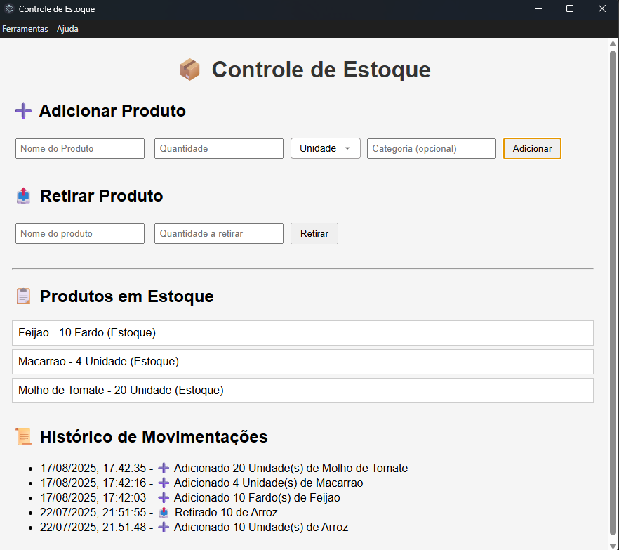

# Estoque App
Projeto de gerenciamento de estoque, usando um framework Electron e o banco de dados SqLite.

## Autor
Patrick G

## Pré-requisitos de instalação:
- Windows 10 ou superior

### Instalação do Sistema de Estoque
Em releases faça o download da última versão (.exe) disponibilizada e execute no computador.
